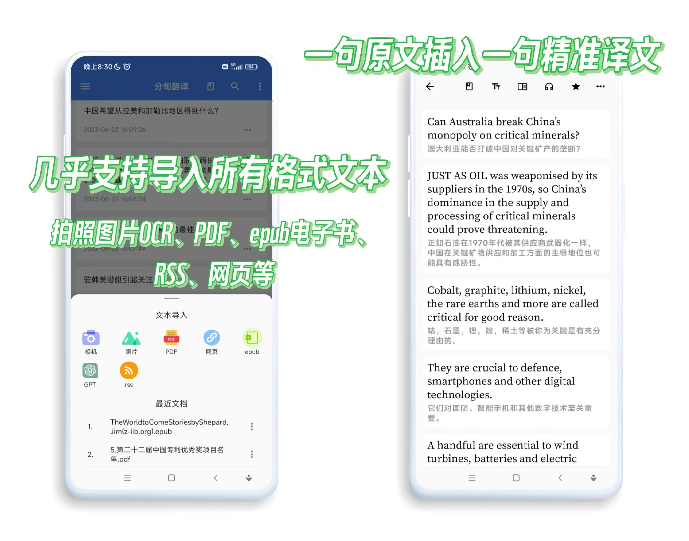
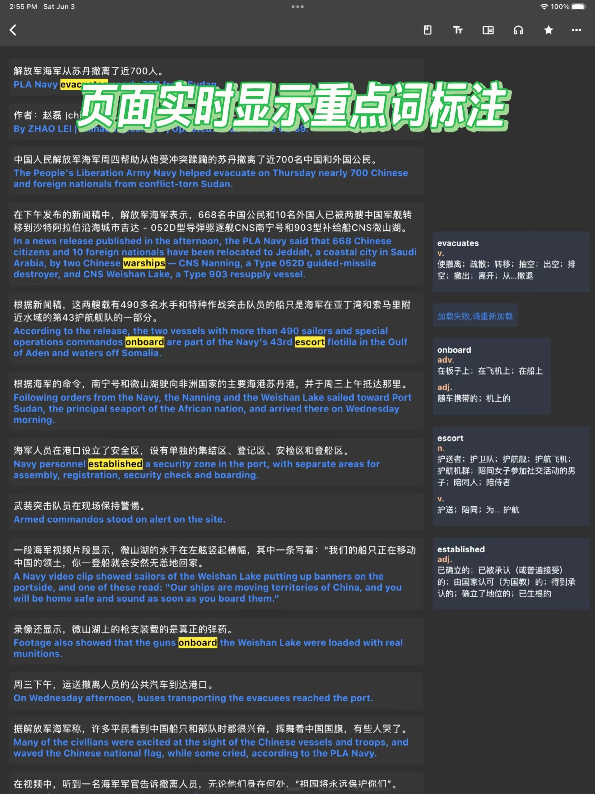
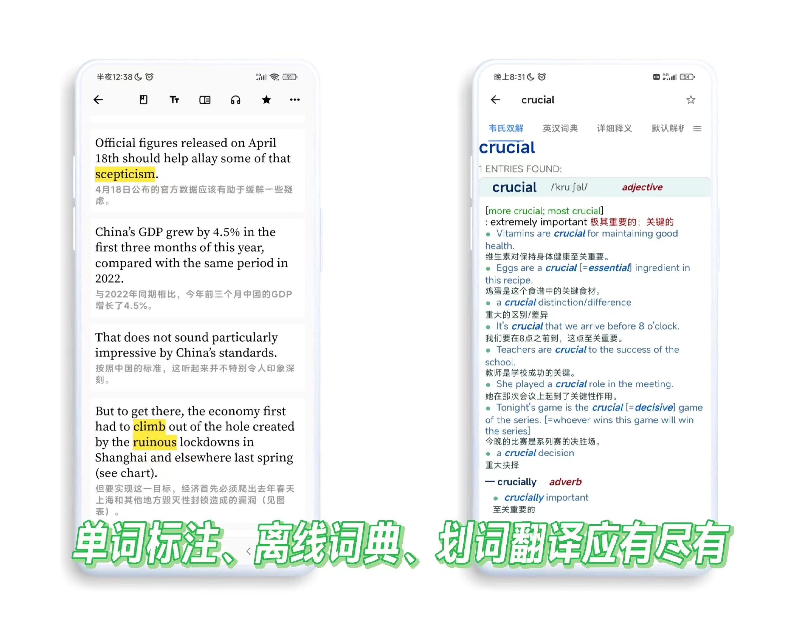
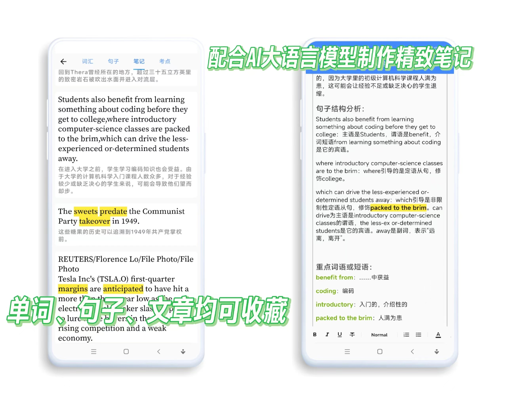
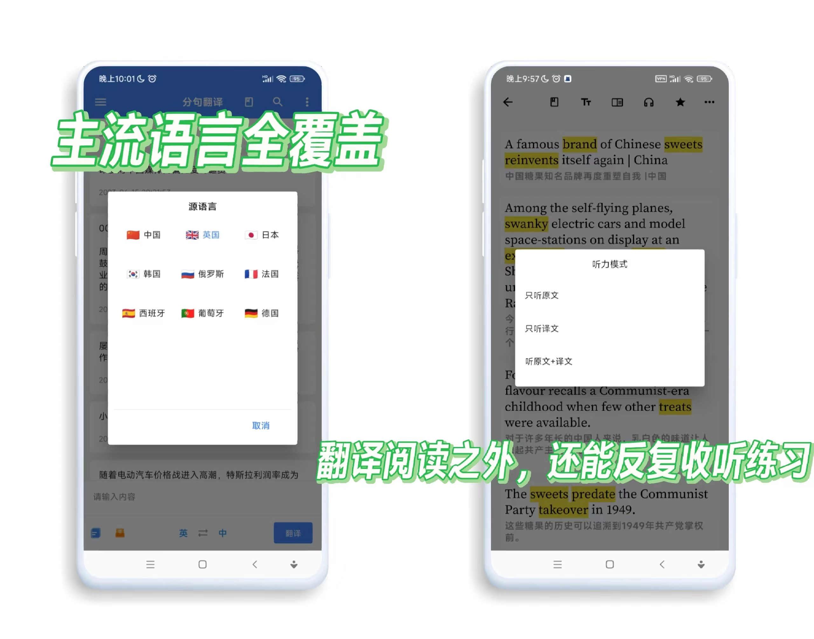

分句翻译是一款强大的逐句翻译工具，它将帮助您轻松应对外文资讯、外文技术教程以及其他您感兴趣的外文内容。无论是导入外文资讯、技术教程，还是您个人的兴趣领域，我们的工具都能自动将其转换为双语阅读。这将有效地辅助您进行阅读学习，提升您的外文阅读能力。

分句翻译具备多项强大的功能，让您的翻译体验更加便捷。首先，我们提供内置的OCR功能，您可以通过拍照或导入相册中的图片文字来识别并导入文本。此外，您还可以通过PDF文件或网页直接导入文本，方便您处理各种类型的外文资料。如果您喜欢阅读epub格式的书籍，我们也支持epub文本的导入。

为了方便您的学习和复习，我们还内置了文章收藏功能。您可以将翻译后的双语文章收藏起来，以便以后进行复习。而在阅读过程中，我们提供了多种翻译方式。您可以通过长按划词或单击单词来进行翻译，而会员用户还可以享受单词收藏和高亮显示的特权。

除了阅读和翻译功能外，我们还为您提供了富文本笔记的支持。您可以对重要的句子进行个人笔记，帮助您更好地理解和记忆内容。此外，我们还提供文章听力功能，让您可以反复听读练习，进一步提升您的外语听力水平。

为了确保您获得准确的翻译结果，我们内置了谷歌翻译、百度翻译、必应翻译、腾讯、彩云小译、deepl等多个翻译引擎。您可以根据自己的需求选择合适的引擎，以获得最佳的翻译效果。

无论您是外语学习者、专业人士还是对外文资讯感兴趣的读者，分句翻译都将成为您不可或缺的助手。立即体验分句翻译，开启您的外语学习之旅！

